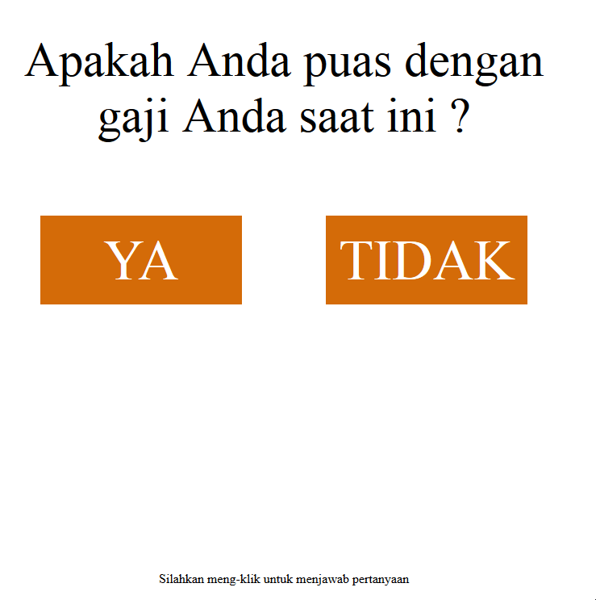

# Salary Survey 2019

**Repo ini dibuat untuk ..**


- Belajar javascript dasar
- Belajar `event` pada javascript
- Belajar _document object model_ (DOM)
- Dan belajar dasar-dasar web programming

**Dibuat menggunakan ..**
- Notepad++
- HTML
- CSS
- Vanilla Javascript

**_Links .._** 
- _See it live! <a href="https://xvferdy.github.io/salary-survey-2019/" target="_blank">Here</a>_
    
**_Acknowledgements .._**
- [GitHub Pages](https://pages.github.com)
- [Joel-James](https://gist.github.com/Joel-James)  

- - -

## :closed_book: Catatan
### _1. Event `mouseover`_ 
sᴄʀɪᴘᴛ.ᴊs
```javascript
var tidak1 = document.querySelector('.tidak1');
var tidak2 = document.querySelector('.tidak2');
var tidak3 = document.querySelector('.tidak3');

tidak1.addEventListener('mouseover', function () {
    tidak1.classList.add('ilang');
    tidak1.classList.remove('ada');
    tidak2.classList.add('ada');
})

tidak2.addEventListener('mouseover', function () {
    tidak2.classList.remove('ada');
    tidak3.classList.add('ada');
})

tidak3.addEventListener('mouseover', function () {
    tidak3.classList.remove('ada');
    tidak1.classList.add('ada');
})
```
### _2. Redirect_
ᴘᴀɢᴇ3.ʜᴛᴍʟ
```javascript
var seconds = 6;
function countdown() {
    seconds = seconds - 1;
    if (seconds < 0) {
        window.location = "https://github.com/xvferdy/salary-survey-2019";
    } else {
        document.getElementById("countdown").innerHTML = seconds;
        window.setTimeout("countdown()", 1000);
    }
}
countdown();
```

